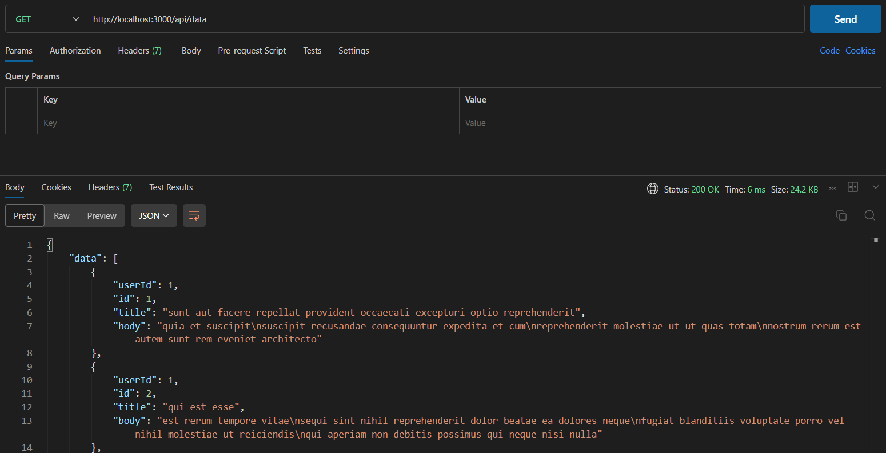
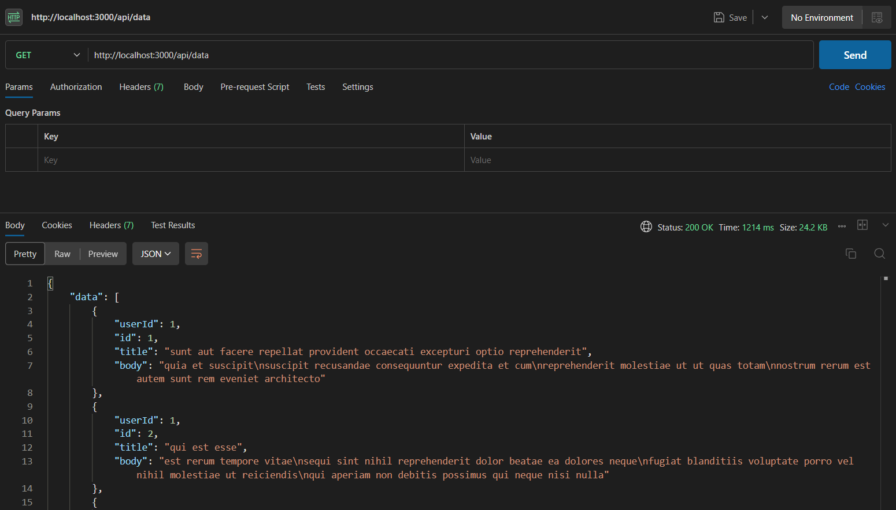

# Redis Node.js Demo

A simple Node.js project demonstrating how to use Redis for caching data in an API.

## Introduction

This project showcases how to integrate Redis for caching in a Node.js application. It uses Express for creating the API and Axios for fetching data from a dummy API. The data fetched from the API is cached in Redis to improve performance.

## Prerequisites

- Node.js (v14.x or higher)
- npm (v6.x or higher)
- Redis (installed and running locally or accessible via a cloud service)

## Usage

1. Start the Node.js server:

```bash
node src/server.js
```

2. Access the API:

- Open your browser or use a tool like curl or Postman to access the API endpoint:

```bash
curl http://localhost:3000/api/data
```

- Before Caching
  
  
- After Caching
  
